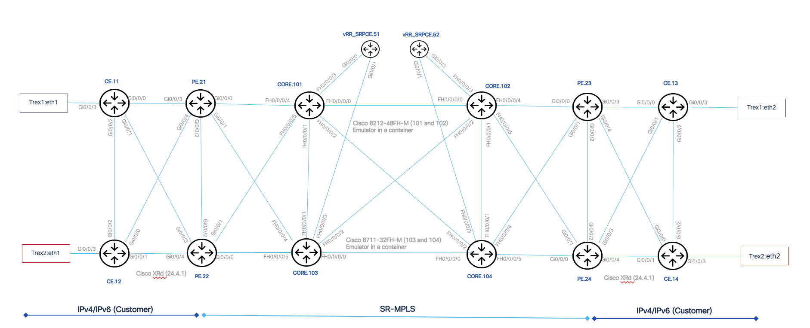
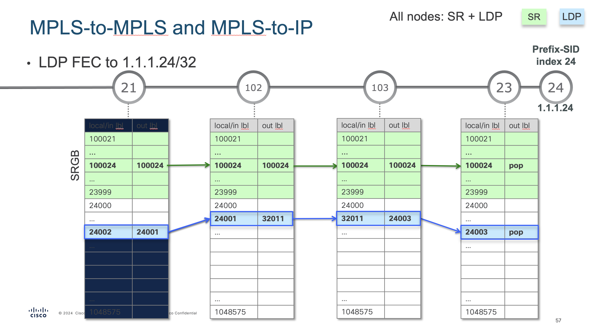
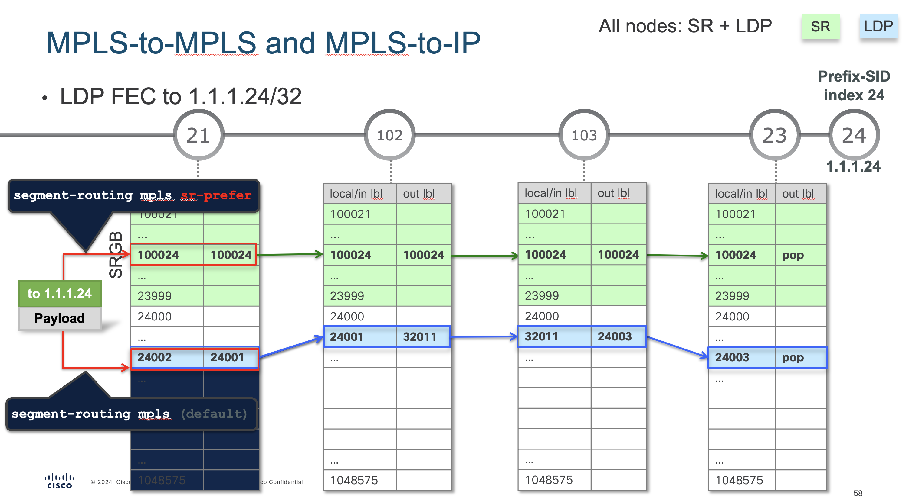

# Introduction to Segment Routing MPLS


## Topology - Introduction to Segment Routing MPLS 



## Lab Objectives

  * Understanding basic Segment Routing configuration
  * How to verify and troubleshoot the control plane
  * How to verify and troubleshoot the data plane
  * Become familiar with SR OAM as a tool for troubleshooting
  * Overview of Topology Independent Loop Free Alternate \(TI\-LFA\)
  * How to verify primary and backup paths of TI\-LFA
  * How to migrate to SR\-MPLS from LDP


## Lab Documentation

This is an open source designed lab which is hosted in Cisco’s dCloud environment\.  The VM in dcloud makes use of ContainerLabs and is available to download to run in your own environment\.

The documentation\, scripts\, and configs are hosted in a public Git repository:

[https://github.com/cisco-asp/asp-sr-mpls-lab](https://github.com/cisco-asp/asp-sr-mpls-lab)

## Converged SDN Transport – Design and Implementation Guide

This lab base configuration closely follows the Converged SDN Transport architecture\.

[http://xrdocs.io/design](http://xrdocs.io/design)


## Lab Content

- [Lab 2.1.1: Basic Segment Routing Configuration - ISIS](#lab-211-basic-segment-routing-configuration-isis)
- [Lab 2.2.1: Segment Routing Control Plane Verification- ISIS](#lab-221-segment-routing-control-plane-isis)
- [Lab 2.3.1: Segment Routing Data Plane Verification - ISIS](#lab-231segment-routing-data-plane-verification)
- [Lab 2.4.1: Troubleshooting with Segment Routing OAM](#lab-241troubleshooting-with-segment-routing-oam)
- [Lab 2.5.1: Topology Independent Loop Free Alternate](#lab-251ti-lfa-configuration-and-verification)
- [Lab 2.6.1: Converting from LDP to SR using SR-prefer](#lab-261-migrating-from-ldp-to-segment-routing)
- [Appendix - Changing the forwarding mode using config_lab](#appendix---changing-for-forwarding-mode-using-config_lab)


For the Intro to SR\-MPLS Lab\, use the included ansible playbooks to generate the configurations for each device and commit them using NETCONF\.

To run the playbook execute the following shell script:

```
./config_lab
```

This ansible playbook does a full commit replace on the configurations of the devices.  If you wish to reset the lab back to this starting point\, you only need to run this playbook again.

Verify that all nodes are listed as "changed".  If any node fails, wait a few minutes for the nodes to finish booting and rerun the config_lab script again.


## Accessing Devices

| Device | Device ID | Management IP | Prefix SID | Username | Password | Kind | Platform/Dataplane | Software Version |                                          
|:------------|:-----------:|:--------------------:|:--------------------:|:--------------------:|:------------|:-----------:|:--------------------:|:--------------------:|   
| CE.11       | 11   | 198.18.130.11   | N/A | admin | cisco123 | xrd | Container/VPP | 25.2.1 |
| CE.12       | 12   | 198.18.130.12   | N/A | admin | cisco123 | xrd | Container/VPP | 25.2.1 |
| CE.13       | 13   | 198.18.130.13   | N/A | admin | cisco123 | xrd | Container/VPP | 25.2.1 |
| CE.14       | 14   | 198.18.130.14   | N/A | admin | cisco123 | xrd | Container/VPP | 25.2.1 |
| PE.21       | 21   | 198.18.130.21   | 100021 |admin | cisco123 | xrd | Container/VPP | 25.2.1 |
| PE.22       | 22   | 198.18.130.22   | 100022 |admin | cisco123 | xrd | Container/VPP | 25.2.1 |
| PE.23       | 23   | 198.18.130.23   | 100023 |admin | cisco123 | xrd | Container/VPP | 25.2.1 |
| PE.24       | 24   | 198.18.130.24   | 100024 |admin | cisco123 | xrd | Container/VPP | 25.2.1 |
| CORE.101    | 101  | 198.18.130.101  | 100101 |admin | cisco123 | c8000 | Cisco 8212-48FH-M | 25.2.1 |
| CORE.102    | 102  | 198.18.130.102  | 100102 |admin | cisco123 | c8000 | Cisco 8212-48FH-M | 25.2.1 |
| CORE.103    | 103  | 198.18.130.103  | 100103 |admin | cisco123 | c8000 | Cisco 8711-32FH-M | 25.2.1 |
| CORE.104    | 104  | 198.18.130.104  | 100104 |admin | cisco123 | c8000 | Cisco 8711-32FH-M | 25.2.1 |
| Trex-1      | 8    | 198.18.130.8  | N/A |root  | cisco123 | linux | Container/VPP | 3.06 |
| Trex-2      | 9    | 198.18.130.9  | N/A |root  | cisco123 | linux | Container/VPP | 3.06 |

# Lab 2.1.1 Basic Segment Routing Configuration (ISIS)

## Segment Routing Configuration - ISIS

__Objective:__

This lab will validate both the control plane functionality and the data plane forwarding path.

There are two minimal requirements to enable Segment Routing.

Configure the Segment Routing Global Block (SRGB)

Enable Segment Routing and Node SID in the IGP

Note: In the presence of a network with LDP enabled\, Segment Routing forwarding paths will not be preferred by default\. This allows you to enable to control\-plane without interrupting the forwarding path.

### Segment Routing Global Block

The Intro to SR-MPLS Lab uses the following segment routing global block:

The default SRGB range is from 16000 to 23999.  In our case, we are using values that are not default.  This is mostly so we can clearly see the prefix sids in show commands.

```
!
segment-routing
 global-block 100000 140000
! 
```
__Lab Task:__

`Log into any PE device (PE.21 recommended) and validate the Segment Routing Global Bllock is configured by using the following show command:`

```
show run segment routing
```


### IGP Configuration - ISIS

Examine the devices IGP configuration and note that segment routing is enabled under the ipv4 unicast address family.  
Additionally, the prefix SID is assigned under the Loopback0 interface for that node. 

The prefix SID is unique per device unless we are using an anycast SID which is out of scope for this part of the lab. 

```diff
router isis ASP_LAB
 set-overload-bit on-startup 300
 is-type level-2-only
 net 49.0011.0001.0000.0021.00
 nsr
 distribute link-state
 nsf ietf
 log adjacency changes
 lsp-gen-interval initial-wait 20 secondary-wait 200 maximum-wait 10000 level 2
 lsp-refresh-interval 65000
 max-lsp-lifetime 65535
 affinity-map GREEN bit-position 0
 address-family ipv4 unicast
  metric-style wide
  metric 100 level 2
  microloop avoidance segment-routing
  mpls traffic-eng level-2-only
  mpls traffic-eng router-id Loopback0
  spf-interval initial-wait 50 secondary-wait 200 maximum-wait 2000
  router-id Loopback0
  redistribute connected route-policy CONNECTED
  segment-routing mpls
 !
…
 interface Loopback0
  passive
  address-family ipv4 unicast
+   prefix-sid index 21

```

### IGP Configuration – Prefix SID

A prefix segment identifier (SID) is associated with an IP prefix. The prefix SID is manually configured from the segment routing global block (SRGB) range of labels. A prefix SID is configured under the loopback interface with the loopback address of the node as the prefix. The prefix segment steers the traffic along the shortest path to its destination.

Option to use either “index” or ”absolute”
Index = SRGB begin + index value
Absolute =  absolute value
The prefix SID is globally unique within the segment routing domain.

```diff
router isis ASP_LAB
<snip>
 !
 interface Loopback0
  passive
  address-family ipv4 unicast
   prefix-sid index 21
  !
 !
```

__Lab Task:__

`Log into any PE device (PE.21 recommended) and validate that Loopback0 is configured with the prefix-sid of 21 for PE.21.`

```
show run router isis
```

# Lab 2.2.1 Segment Routing Control Plane: ISIS

In this section, we will verify that the ISIS control plane is correctly distributing the prefix-sids. 

* Segment Routing information is distributed in the lab using the IGP
* IGP contains BOTH the prefixes AND the labels
* No LDP configuration is needed\.
  * No LDP/IGP sync issues
  * No session protection is needed
* ISIS (RFC 8667)
  * Prefix SID and Adjacency SID information carried in Sub\-TLVs
  * The Prefix\-SID sub\-TLV carries the Segment Routing IGP\-Prefix\-SID as defined in \[RFC8402\]\.
* OSPF \(RFC 8665\):
  * SR capabilities are advertised in the Router Information Opaque LSA \(defined in \[[RFC7770](https://datatracker.ietf.org/doc/html/rfc7770)\]\)\.
  * Prefix SID and Adjacency SID information carried in sub\-TLVs
* The 'Prefix\-SID' MUST be unique within a given IGP domain \(when the L\-Flag is not set\)\.


__Lab Task:__

`From the CLI of any device, show the labels learned via ISIS. Verify devices are seeing the labels in the IGP domain that is enabled for SR MPLS`

```
show isis segment-routing label table 
```

Note the Algo 0 labels learned via ISIS. These are indicated as algorithm "SPF"

The lab is configured for flex algo\, so while these are observed\, the labels for the other algos FA128 and FA129 can be ignored for now.

```diff
RP/0/RP0/CPU0:PE.21#show isis segment-routing label table 
Mon Jan  6 10:17:43.231 EST

IS-IS ASP_LAB IS Label Table
Label         Prefix                   Algorithm    Interface
----------    ----------------         ---------    ---------
100021        1.1.1.21/32              SPF          Loopback0
100022        1.1.1.22/32              SPF          
100023        1.1.1.23/32              SPF          
100024        1.1.1.24/32              SPF          
100101        1.1.1.101/32             SPF          
100102        1.1.1.102/32             SPF          
100103        1.1.1.103/32             SPF          
100104        1.1.1.104/32             SPF          
128021        1.1.1.21/32              FA 128       Loopback0
128022        1.1.1.22/32              FA 128       
128023        1.1.1.23/32              FA 128       
128024        1.1.1.24/32              FA 128       
128101        1.1.1.101/32             FA 128       
128102        1.1.1.102/32             FA 128       
129021        1.1.1.21/32              FA 129       Loopback0
```

### SR info in the ISIS Database

SR information is distributed with in the IGP\, in this case – ISIS LSPs

Every device in the topology will have the same database / view \(Link state protocol\)

You can see what information is distributed by examining the LS database on any node in the domain

```diff
RP/0/RP0/CPU0:PE.21#show isis database 
Mon Jan  6 10:23:54.544 EST

IS-IS ASP_LAB (Level-2) Link State Database
LSPID                 LSP Seq Num  LSP Checksum  LSP Holdtime/Rcvd  ATT/P/OL
PE.21.00-00         * 0x00000009   0x14ba        62490/*            0/0/0
PE.22.00-00           0x00000008   0xafe6        62488/65535        0/0/0
PE.23.00-00           0x00000008   0x7e48        62488/65535        0/0/0
PE.24.00-00           0x00000009   0xb25d        62487/65535        0/0/0
vRR-SR-PCE.51.00-00   0x00000005   0x100c        62461/65535        0/0/1
vRR-SR-PCE.52.00-00   0x00000005   0x6b67        62469/65535        0/0/1
CORE.101.00-00        0x0000000a   0x8768        62469/65535        0/0/0
CORE.101.00-01        0x00000002   0xa650        62469/65535        0/0/0
CORE.102.00-00        0x00000009   0x75ad        62469/65535        0/0/0
CORE.102.00-01        0x00000001   0x0299        62469/65535        0/0/0
CORE.103.00-00        0x00000008   0xb5fd        62468/65535        0/0/0
CORE.103.00-01        0x00000002   0xa752        62469/65535        0/0/0
CORE.104.00-00        0x00000005   0xd78e        62467/65535        0/0/0
CORE.104.00-01        0x00000001   0xa5d6        62467/65535        0/0/0

```

__Lab Task:__

`Validate that the device is receiving the ISIS LSPs from the other devices in the topology.`

```
show isis database
```


### SR info in the ISIS Database – Prefix SID / SRGB

The device distributes the Segment Routing information in the ISIS LSP.  By viewing PE.21s recieved LSPs from other dsevices in the topology we can see the information it will use to build it's label database.

__Lab Task:__

`Validate the LSP receieved from the other nodes.  In the below example, we are examining the LSP database from PE.23 in detail`

```
show isis database PE.23.00-00 detail verbose 
```


```diff
RP/0/RP0/CPU0:PE.21#show isis database PE.23.00-00 detail verbose 
Mon Jan  6 10:29:31.900 EST

IS-IS ASP_LAB (Level-2) Link State Database
LSPID                 LSP Seq Num  LSP Checksum  LSP Holdtime/Rcvd  ATT/P/OL
PE.23.00-00           0x00000008   0x7e48        62151/65535        0/0/0
  Area Address:   49.0011
  LSP MTU:        1492
  NLPID:          0xcc
  NLPID:          0x8e
  MT:             Standard (IPv4 Unicast)
  MT:             IPv6 Unicast                                 0/0/0
  Router ID:      1.1.1.23
  IP Address:     1.1.1.23
  IPv6 Address:   23:23:23::23
  Hostname:       PE.23
  Router Cap:     1.1.1.23 D:0 S:0
+    Segment Routing: I:1 V:1, SRGB Base: 100000 Range: 40001
    SR Local Block: Base: 15000 Range: 1000
    Node Maximum SID Depth: 
      Label Imposition: 10
…
 Metric: 0          IP-Extended 1.1.1.23/32
+    Prefix-SID Index: 23, Algorithm:0, R:0 N:1 P:0 E:0 V:0 L:0
    Prefix-SID Index: 28023, Algorithm:128, R:0 N:1 P:0 E:0 V:0 L:0
    Prefix-SID Index: 29023, Algorithm:129, R:0 N:1 P:0 E:0 V:0 L:0
    Prefix-SID Index: 30023, Algorithm:130, R:0 N:1 P:0 E:0 V:0 L:0
    Prefix Attribute Flags: X:0 R:0 N:1 E:0 A:0
    Source Router ID: 1.1.1.23
```

We are specifically looking for the SRBG and the Algo 0 prefix SID as highlighted. 

Note that the flags distributed with the SID have specific meaning and that N=1 is indicated this is a Node SID.

Explaination of the flag values:
```
R:0	not Re-advertised
N:1	node SID
P:0	PHP on
E:0	explicit-NULL off
V:0	index
L:0	global significance
```


### SR info in the ISIS Database – Adjacency SIDs, advertised delay and bandwidth

Dynamic labels, not the SRGB, are used to specify the links.  These labels are only locally significant to the device.  You can specify which labels are used for the local block if desired. 

The ISIS database also contains information that can be used to make path decisions in the case of traffic engineering.  Note below that we are advertising SR PM probe data as well as the bandwidth information.


```diff
RP/0/RP0/CPU0:PE.21#show isis database PE.23.00-00 detail verbose
…

 Metric: 100        IS-Extended PE.24.00
    Local Interface ID: 6, Remote Interface ID: 5
    Interface IP Address: 10.23.24.0
    Neighbor IP Address: 10.23.24.1
+    Physical BW: 1000000 kbits/sec, 125000000 bytes/sec
    Admin. Weight: 120
+    Link Average Delay: 1116 us
+    Link Min/Max Delay: 901/1442 us
+    Link Delay Variation: 215 us
    Application Specific Link Attributes: 
      L flag: 0, SA-Length: 1, UDA-Length: 1
      Standard Applications: 0x10 FLEX-ALGO
      User Defined Applications: 0x10
      Link Min/Max Delay: 901/1442 us
+    ADJ-SID: F:0 B:1 V:1 L:1 S:0 P:0 weight:0 Adjacency-sid:24000
+    ADJ-SID: F:0 B:0 V:1 L:1 S:0 P:0 weight:0 Adjacency-sid:24001
```

__Lab Task:__

`Use the following command to validate the links are advertising the Adj-SIDs and the Bandwidth/probe data`

```
show isis database PE.24.00-00 detail verbose 
```


### MPLS Label Forwarding Information Base (LFIB)

Validate the prefix SIDs are visible in the Label Forwarding Information Base \(LFIB\)\.

Note the local label and the outgoing labels for the prefix SIDs\.

Labels are displayed in descending order\, so scroll down to see where the label values start \(100000\)

Notice that this example shows active and backup paths

```diff
RP/0/RP0/CPU0:PE.21#show mpls forwarding 
Tue Jan  7 15:15:51.308 EST
Local  Outgoing    Prefix             Outgoing     Next Hop        Bytes       
Label  Label       or ID              Interface                    Switched    
------ ----------- ------------------ ------------ --------------- ------------
<output omitted>
100021 Aggregate   SR Pfx (idx 21)    default                      0           
100022 Pop         SR Pfx (idx 22)    Gi0/0/0/2    10.21.22.1      0           
       100022      SR Pfx (idx 22)    Gi0/0/0/0    10.21.101.1     0            (!)
100023 100023      SR Pfx (idx 23)    Gi0/0/0/0    10.21.101.1     0           
       100023      SR Pfx (idx 23)    Gi0/0/0/1    10.21.103.1     0           
100024 100024      SR Pfx (idx 24)    Gi0/0/0/0    10.21.101.1     0           
       100024      SR Pfx (idx 24)    Gi0/0/0/1    10.21.103.1     0           
100101 Pop         SR Pfx (idx 101)   Gi0/0/0/0    10.21.101.1     0           
       100101      SR Pfx (idx 101)   Gi0/0/0/2    10.21.22.1      0            (!)
100102 100102      SR Pfx (idx 102)   Gi0/0/0/0    10.21.101.1     0           
       100102      SR Pfx (idx 102)   Gi0/0/0/1    10.21.103.1     0           
100103 Pop         SR Pfx (idx 103)   Gi0/0/0/1    10.21.103.1     0           
       100103      SR Pfx (idx 103)   Gi0/0/0/0    10.21.101.1     0            (!)
100104 100104      SR Pfx (idx 104)   Gi0/0/0/0    10.21.101.1     0           
       100104      SR Pfx (idx 104)   Gi0/0/0/1    10.21.103.1     0           
128021 Aggregate   SR Pfx (idx 28021) default                      0           
128022 Pop         SR Pfx (idx 28022) Gi0/0/0/2    10.21.22.1      0           
       128022      SR Pfx (idx 28022) Gi0/0/0/0    10.21.101.1     0            (!)
128023 128023      SR Pfx (idx 28023) Gi0/0/0/0    10.21.101.1     0           
       128023      SR Pfx (idx 28023) Gi0/0/0/2    10.21.22.1      0            (!)
128024 128024      SR Pfx (idx 28024) Gi0/0/0/0    10.21.101.1     0           
       128024      SR Pfx (idx 28024) Gi0/0/0/2    10.21.22.1      0            (!)
```

# LFIB


---

ECMP, or natural load balancing, a characteristic of SR.

# Lab 2.3.1Segment Routing Data Plane Verification

## SR uses the MPLS Data Plane

* SR has segments: 1 segment represented by 1 label in MPLS label stack
* <span style="color:#0070c0">SR uses the existing MPLS data plane</span>
  * <span style="color:#0070c0">No exceptions</span>
  * MPLS label operations:
    * Push\, Pop\, and Swap
  * We have
    * Special labels \{0 \- 15\}
      * PHP \(default behavior\, also for SR\)
      * explicit\-null for IPv4 and IPv6
    * Regular labels \{16 \- 1048575\}
      * Static labels \{16 \- 4095\}
      * <span style="color:#0070c0">SRGB \{16000 \- 23999\} – Prefix\-SIDs</span>
      * <span style="color:#0070c0">Dynamic range \{24000 \- 1048575\} – includes </span>  <span style="color:#0070c0">Adj</span>  <span style="color:#0070c0">\-SIDs</span>
    * QOS  propagation \(EXP bits\)
      * Still uniform model\, pipe\, and short pipe model
    * TTL propagation as usual


## MPLS Label Operation: Push Label(s)

* Push can occur at ingress of MPLS domain
  * MPLS label stack added in  <span style="color:#0070c0">CEF \(FIB\) </span> table
  * Top label is SR label; other labels can be service labels \(e\.g\. MPLS VPN\, BGP\-LU\, etc\.\)
* Push can occur at intermediate MPLS \(P\) router
  * MPLS label\(s\) added in  <span style="color:#0070c0">LFIB</span>  \(e\.g\. active FRR\)


Note that "labeled SR" must be present except for TI-LFA prefixes.

```diff
RP/0/0/CPU0:R1# show route 10.100.1.3/32

Routing entry for 10.100.1.3/32
+  Known via "isis 1", … , labeled SR, …
   Routing Descriptor Blocks
    10.1.15.5, from 10.100.1.3, via GigabitEthernet0/0/0/0
      Route metric is 60
```

```diff
RP/0/0/CPU0:R1# show cef …

+10.100.1.3/32, …  labeled SR, …

 via 10.1.12.2/32, GigabitEthernet0/0/0/1,…
 local label 16003      labels imposed {16003}   
```

### MPLS Label Operation: Swap Label(s)

* Swap occurs at intermediate MPLS \(P\) router
  * Only top label is swapped
  * MPLS label is swapped in  <span style="color:#00b0f0">LFIB</span>
  * Other labels are not touched \(EXP bits\, TTL\)
  * Within one SR segment\, top label is swapped with same label


```diff
RP/0/0/CPU0:R2# show mpls forwarding labels 16004

Local  Outgoing    Prefix             Outgoing     Next Hop        Bytes
Label  Label       or ID              Interface                    Switched
------ ----------- ------------------ ------------ --------------- ------------
16004  16004       SR Pfx (idx 4)     Gi0/0/0/1    10.1.59.9       1420

```

* Pop occurs at intermediate MPLS \(P\) router: top label is removed
* By default on penultimate router of one SR segment
  * Label stack could become unlabeled
  * Label stack can still have other labels
    * e\.g\. when packet is moved from one SR segment to another SR segment


```diff
RP/0/0/CPU0:R3# show mpls forwarding labels 16004

Local  Outgoing    Prefix             Outgoing     Next Hop        Bytes
Label  Label       or ID              Interface                    Switched
------ ----------- ------------------ ------------ --------------- ------------
16004  Pop         SR Pfx (idx 4)     Gi0/0/0/3    10.1.46.4       1880280
```

### Viewing the CEF table

We can also validate what label stack would be pushed to a certain destination by looking at the FIB / CEF table\.

This command shows the label stack that is imposed to the destination in the current state

And the backup TI\-LFA labels imposed should there be a failure on the link/node \(configuration dependent\)\.

```diff
RP/0/RP0/CPU0:PE.21#show cef 1.1.1.22/32 
Mon Jan  6 10:48:20.242 EST
1.1.1.22/32, version 287, labeled SR, internal 0x1000001 0x8310 (ptr 0x8722ea60) [1], 0x600 (0x88441698), 0xa28 (0x9bd809e0)
 Updated Jan  6 09:33:10.583 
 local adjacency to GigabitEthernet0/0/0/2

 Prefix Len 32, traffic index 0, precedence n/a, priority 1
  gateway array (0x882dce98) reference count 3, flags 0x500068, source rib (7), 0 backups
                [3 type 4 flags 0x8401 (0x9708f430) ext 0x0 (0x0)]
  LW-LDI[type=1, refc=1, ptr=0x88441698, sh-ldi=0x9708f430]
  gateway array update type-time 1 Jan  6 09:33:10.583
 LDI Update time Jan  6 09:33:10.583
 LW-LDI-TS Jan  6 09:33:10.583
   via 10.21.101.1/32, GigabitEthernet0/0/0/0, 14 dependencies, weight 0, class 0, backup (Local-LFA) [flags 0x300]
    path-idx 0 NHID 0x7 [0x99c99308 0x0]
    next hop 10.21.101.1/32
    local adjacency
+     local label 100022      labels imposed {100022}
   via 10.21.22.1/32, GigabitEthernet0/0/0/2, 8 dependencies, weight 0, class 0, protected [flags 0x400]
    path-idx 1 bkup-idx 0 NHID 0x6 [0x9be5c370 0x9be5c280]
    next hop 10.21.22.1/32
+     local label 100022      labels imposed {ImplNull}

    Load distribution: 0 (refcount 3)

    Hash  OK  Interface                 Address
    0     Y   GigabitEthernet0/0/0/2    10.21.22.1 

```


__Lab Task:__

`Examine multiple other devices by replacing XX with the device id.`

```
show cef 1.1.1.XX/32 
```

### Load Balancing MPLS Traffic


* Routers will try to load balance on the IP header\, even when there is a label stack
  * IP traffic is best load\-balanced by calculating hash over  <span style="color:#0070c0">3\- or 7\-tuple\*</span>
* PseudoWire traffic is load\-balanced by calculating hash over the bottom label \( <span style="color:#0070c0">PW service label</span> \)
  * Preserving per\-flow load balancing
* Flow Aware Transport \(FAT\) Label can be used
  * Endpoints need to support this signaling
  * Endpoints classify traffic and pushes a unique flow label for each flow \(each PW\)
  * Load balancing on bottom \(FAT\) label
  * More granular than load balancing
* If many labels are present in label stack and the  <span style="color:#0070c0">platform</span>  cannot look at/past last label\, there is load balancing on higher label in the stack
  * \* 3\- Source IP\, Destination IP\, Router ID
  * 7\- Source IP\, Destination IP\, Router ID\, Source port\, Destination port\, Protocol\, Ingress interface handle
---

RFC6391
It depends on the platform how the load balancing is done. And, how deep the platform can go to look up the label.


# Lab 2.4.1Troubleshooting with Segment Routing OAM

## Segment Routing OAM MPLS

* Segment Routing Operations\, Administration\, and Maintenance \(OAM\) helps service providers to monitor label\-switched paths \(LSPs\) and quickly isolate forwarding problems to assist with fault detection and troubleshooting in the network\.
* The Segment Routing OAM feature provides support for Nil\-FEC \(forwarding equivalence classes\) LSP Ping and Traceroute\, IGP prefix SID FEC type\, and partially IGP adjacency\-SID FEC type for SR\-TE functionality\.
* MPLS ping and traceroute are extendable by design\. You can add SR support by defining new FECs and/or additional verification procedures\.
* MPLS ping verifies MPLS data path and performs the following:
  * Encapsulates echo request packet in MPLS labels\.
  * Measures coarse round trip time\.
  * Measures coarse round trip delay\.
* MPLS traceroute verifies forwarding and control plane at each hop of the LSP to isolate faults\.


## Segment Routing MPLS Ping


* MPLS ping verifies MPLS data path and performs the following:
  * Encapsulates echo request packet in MPLS labels\.
  * Measures coarse round trip time\.
  * Measures coarse round trip delay\.

```diff
RP/0/RP0/CPU0:PE.21#ping sr-mpls labels 100024 output interface gigabitEthernet 0/0/0/0 nexthop 10.21.101.1 
Tue Jan 14 08:42:26.229 EST

Sending 5, 100-byte MPLS Echos with Nil FEC with labels [100024],
      timeout is 2 seconds, send interval is 0 msec:

Codes: '!' - success, 'Q' - request not sent, '.' - timeout,
  'L' - labeled output interface, 'B' - unlabeled output interface, 
  'D' - DS Map mismatch, 'F' - no FEC mapping, 'f' - FEC mismatch,
  'M' - malformed request, 'm' - unsupported tlvs, 'N' - no rx label, 
  'P' - no rx intf label prot, 'p' - premature termination of LSP, 
  'R' - transit router, 'I' - unknown upstream index,
  'X' - unknown return code, 'x' - return code 0

Type escape sequence to abort.

 !!!!!
Success rate is 100 percent (5/5), round-trip min/avg/max = 5/6/8 ms
```

__Lab Task:__

`Use sr-mpls ping to validate the SR MPLS data path and round trip time. Try this by changing the label value to another node in the network.`

```
ping sr-mpls labels 100024 output interface gigabitEthernet 0/0/0/0 nexthop 10.21.101.1 
```


## Traceroute mpls | sr-mpls

Traceroute sends MPLS echo requests with monotonically increasing time\-to\-live \(TTL\)\, starting with TTL of 1\.

Upon TTL expiry\, transit node processes the request in software and verifies if it has an LSP to the target FEC and intended transit node\.

The transit node sends echo reply containing return code specifying the result of above verification and label stack to reach the next\-hop\, as well as ID of the next\-hop towards destination\.

If verification is successful\. Originator processes echo reply to build the next echo request containing TTL\+1\.

Process is repeated until the destination replies that it is the egress for the FEC\.

## Traceroute


__Traceroute \(ipv4\)__

Traceroute will display the label value

Assuming TTL Propagate is on \(not disabled\)

In this lab\, TTL propagate is enabled

```diff
RP/0/RP0/CPU0:PE.21#traceroute 1.1.1.24   
Tue Jan 14 08:32:38.961 EST

Type escape sequence to abort.
Tracing the route to 1.1.1.24

 1  10.21.103.1 [MPLS: Label 100024 Exp 0] 12 msec  8 msec  8 msec 
 2  10.102.103.0 [MPLS: Label 100024 Exp 0] 18 msec  8 msec  8 msec 
 3  10.23.102.0 [MPLS: Label 100024 Exp 0] 5 msec  6 msec  7 msec 
 4  10.23.24.1 6 msec  *  6 msec 
```


__Traceroute extended for MPLS__

Traceroute mpls or sr\-mpls makes the destination address non\-routeable \(i\.e\. 127\.x\.x\.x/8\) so that the packet is not IP forwarded

Can also include additional label values and exp bits for testing other label stack attributes

```diff
RP/0/RP0/CPU0:PE.21#traceroute sr-mpls 1.1.1.24/32
Tue Jan 14 08:32:57.271 EST

Tracing MPLS Label Switched Path to 1.1.1.24/32, timeout is 2 seconds

Codes: '!' - success, 'Q' - request not sent, '.' - timeout,
  'L' - labeled output interface, 'B' - unlabeled output interface, 
  'D' - DS Map mismatch, 'F' - no FEC mapping, 'f' - FEC mismatch,
  'M' - malformed request, 'm' - unsupported tlvs, 'N' - no rx label, 
  'P' - no rx intf label prot, 'p' - premature termination of LSP, 
  'R' - transit router, 'I' - unknown upstream index,
  'X' - unknown return code, 'x' - return code 0

Type escape sequence to abort.

  0 10.21.103.0 MRU 8968 [Labels: 100024 Exp: 0]
L 1 10.21.103.1 MRU 8968 [Labels: 100024 Exp: 0] 23 ms
L 2 10.102.103.0 MRU 8968 [Labels: 100024 Exp: 0] 27 ms
L 3 10.23.102.0 MRU 8968 [Labels: implicit-null Exp: 0] 7 ms
 ! 4 10.23.24.1 6 ms
```

Like ping \(lsp\)\, traceroute has been extended for mpls and sr\-mpls\.

Sr\-mpls includes the ability to specify the prefix\-SID \(labels\)\, next\-hop output interface\, or SR Policy\.

```diff
RP/0/RP0/CPU0:PE.21#traceroute sr-mpls labels 100024 output interface gigabitEthernet 0/0/0/0 nexthop 10.21.101.1 exp 4   
Tue Jan 14 09:59:03.576 EST

Tracing MPLS Label Switched Path with Nil FEC with labels [100024], timeout is 2 seconds

Codes: '!' - success, 'Q' - request not sent, '.' - timeout,
  'L' - labeled output interface, 'B' - unlabeled output interface, 
  'D' - DS Map mismatch, 'F' - no FEC mapping, 'f' - FEC mismatch,
  'M' - malformed request, 'm' - unsupported tlvs, 'N' - no rx label, 
  'P' - no rx intf label prot, 'p' - premature termination of LSP, 
  'R' - transit router, 'I' - unknown upstream index,
  'X' - unknown return code, 'x' - return code 0

Type escape sequence to abort.

  0 10.21.101.0 MRU 8968 [Labels: 100024/explicit-null Exp: 4/4]
L 1 10.21.101.1 MRU 8968 [Labels: 100024/explicit-null Exp: 4/4] 10 ms
L 2 10.101.104.1 MRU 8968 [Labels: 100024/explicit-null Exp: 4/4] 14 ms
L 3 10.23.104.0 MRU 8968 [Labels: implicit-null/explicit-null Exp: 4/4] 7 ms
 ! 4 10.23.24.1 8 ms
```

__Lab Task:__

`Use sr-mpls traceroute to validate the SR MPLS data path and round trip time. Specify the EXP bit to show that this is also propogated in the network. Try this by changing the label value to another node in the network.`

```
traceroute sr-mpls labels 100024 output interface gigabitEthernet 0/0/0/0 nexthop 10.21.101.1 exp 4
```

## Mutipath traceroute

A common scenerio in networks is to have multiple paths between source and destination. Normal traceroute only shows a single path.  A Better output and more detail about the multiple paths can be seen using multipath traceroute.

We have ECMP in this example

4 Paths Found

Per\-flow load\-balancing:

21 \-> 101 \-> 102 \-> 23

21 \-> 101 \-> 104 \-> 23

21 \-> 103 \-> 104 \-> 23

21 \-> 103 \-> 102 \-> 23

```diff
RP/0/RP0/CPU0:PE.21#traceroute sr-mpls multipath 1.1.1.24/32 verbose 
Mon Jan  6 11:13:33.552 EST

Starting LSP Path Discovery for 1.1.1.24/32

Codes: '!' - success, 'Q' - request not sent, '.' - timeout,
  'L' - labeled output interface, 'B' - unlabeled output interface, 
  'D' - DS Map mismatch, 'F' - no FEC mapping, 'f' - FEC mismatch,
  'M' - malformed request, 'm' - unsupported tlvs, 'N' - no rx label, 
  'P' - no rx intf label prot, 'p' - premature termination of LSP, 
  'R' - transit router, 'I' - unknown upstream index,
  'X' - unknown return code, 'x' - return code 0

Type escape sequence to abort.

LLL!
Path 0 found, 
 output interface GigabitEthernet0/0/0/0 nexthop 10.21.101.1
 source 10.21.101.0 destination 127.0.0.0
  0 10.21.101.0 10.21.101.1 MRU 8968 [Labels: 100024 Exp: 0] multipaths 0
L 1 10.21.101.1 10.101.102.1 MRU 8968 [Labels: 100024 Exp: 0] ret code 8 multipaths 2
L 2 10.101.102.1 10.23.102.0 MRU 8968 [Labels: 100024 Exp: 0] ret code 8 multipaths 1
L 3 10.23.102.0 10.23.24.1 MRU 8968 [Labels: implicit-null Exp: 0] ret code 8 multipaths 1
 ! 4 10.23.24.1, ret code 3 multipaths 0
LL!
Path 1 found, 
 output interface GigabitEthernet0/0/0/0 nexthop 10.21.101.1
 source 10.21.101.0 destination 127.0.0.1
  0 10.21.101.0 10.21.101.1 MRU 8968 [Labels: 100024 Exp: 0] multipaths 0
L 1 10.21.101.1 10.101.104.1 MRU 8968 [Labels: 100024 Exp: 0] ret code 8 multipaths 2
L 2 10.101.104.1 10.23.104.0 MRU 8968 [Labels: 100024 Exp: 0] ret code 8 multipaths 1
L 3 10.23.104.0 10.23.24.1 MRU 8968 [Labels: implicit-null Exp: 0] ret code 8 multipaths 1
 ! 4 10.23.24.1, ret code 3 multipaths 0
LLL!
Path 2 found, 
 output interface GigabitEthernet0/0/0/1 nexthop 10.21.103.1
 source 10.21.103.0 destination 127.0.0.0
  0 10.21.103.0 10.21.103.1 MRU 8968 [Labels: 100024 Exp: 0] multipaths 0
L 1 10.21.103.1 10.103.104.1 MRU 8968 [Labels: 100024 Exp: 0] ret code 8 multipaths 2
L 2 10.103.104.1 10.23.104.0 MRU 8968 [Labels: 100024 Exp: 0] ret code 8 multipaths 1
L 3 10.23.104.0 10.23.24.1 MRU 8968 [Labels: implicit-null Exp: 0] ret code 8 multipaths 1
 ! 4 10.23.24.1, ret code 3 multipaths 0
LL!
Path 3 found, 
 output interface GigabitEthernet0/0/0/1 nexthop 10.21.103.1
 source 10.21.103.0 destination 127.0.0.1
  0 10.21.103.0 10.21.103.1 MRU 8968 [Labels: 100024 Exp: 0] multipaths 0
L 1 10.21.103.1 10.102.103.0 MRU 8968 [Labels: 100024 Exp: 0] ret code 8 multipaths 2
L 2 10.102.103.0 10.23.102.0 MRU 8968 [Labels: 100024 Exp: 0] ret code 8 multipaths 1
L 3 10.23.102.0 10.23.24.1 MRU 8968 [Labels: implicit-null Exp: 0] ret code 8 multipaths 1
 ! 4 10.23.24.1, ret code 3 multipaths 0

Paths (found/broken/unexplored) (4/0/0)
 Echo Request (sent/fail) (14/0)
 Echo Reply (received/timeout) (14/0)
 Total Time Elapsed 172 ms

```


__Lab Task:__

`Validate the multiple paths between PE.21 and PE24 using the multipath traceroute command.`

```
traceroute sr-mpls multipath 1.1.1.24/32 verbose 
```

## Equal Cost Multi Path for this example

Notice this is multi\-path vs a backup route – no \(\!\).  This can only be a prefix-sid.

```diff
RP/0/RP0/CPU0:PE.21#sh mpls forwarding labels 100024
Mon Jan  6 11:15:31.641 EST
Local  Outgoing    Prefix             Outgoing     Next Hop        Bytes       
Label  Label       or ID              Interface                    Switched    
------ ----------- ------------------ ------------ --------------- ------------
100024 100024      SR Pfx (idx 24)    Gi0/0/0/0    10.21.101.1     128         
       100024      SR Pfx (idx 24)    Gi0/0/0/1    10.21.103.1     1664 

```

# Lab 2.5.1TI-LFA Configuration and Verification


## Topology Independent Loop Free Alternate (TI-LFA)
It is paramount for operators to provide services with SLA guarantees and to automatically restore connectivity in the case of a network component failure. By relying on SR, TI-LFA provides a local repair mechanism to achieve this goal. With behaviors described in an IETF draft, TI-LFA provides key benefits, including:
Automatic Per-Destination protection – automatic backup paths are pre-computed by the IGP for each destination (prefix). TI-LFA prepares a data-plane switch-over to be activated upon detection of the failure of a link used to reach a given destination
Topology Independent coverage – TI-LFA provides sub-50msec link, node and SRLG protection for ANY topology. TI-LFA provides a loop free backup path irrespective of the topologies prior the failure and after the failure
Optimal routing – TI-LFA provides optimal routing by enforcing a backup path that is identical to the post-convergence path
Stateless operation – based on source routing paradigm, there is no need to create additional forwarding state in the network in order to enforce a backup path
Because of its benefits, TI-LFA was and continues to be one of the main drivers behind SR deployments. It has been one of the key areas of research and execution for Cisco since its release in 2014. Key principles of Cisco’s TI-LFA implementation include:
Comprehensive protection - starting from the most common link protection to more sophisticated node, local SRLG and now also remote SRLG protection types
Efficient and Scalable - backup path computation for each destination prefix in the network
Performant - prefix-independent backup path activation
Feature rich - protection beyond SR, implementation also protects traffic that originally is forwarded using other paradigms such as LDP signaling or pure IP-routed traffic

TI-LFA solves the problem of incomplete coverage and topology dependent coverage of classical LFA.

Automated Topology Independent with guaranteed sub-50ms per-prefix protection

- Simple and Automated
  - IGP computed / No midpoint backup state

- Optimal 
  - Backup path following post-convergence path

- Scalable
	- Cisco’s TI-FLA algorithm – optimized for scalability 

- Post-convergence path computation and SID-list encoding


### Stabilize with Microloop Avoidance

__Without microloop avoidance:__

* __Micro\-loops__ : a day\-one IP drawback
  * Micro\-loops are  __transient__  packet loops that occur  __during network convergence __ \(link up/down\)
  * Mostly due to nodes on the path reaching convergence at different times
  * These micro\-loops are  __causing packet loss __ and  __out of order packets__
* __IF__  micro\-loops are possible on post\-convergence path to a destination
  * __THEN__  node automatically computes a SID\-list to steer traffic to that destination loop\-free over the post\-convergence path


* __Robust network convergence from link up/down events__
  * Zero packet loss or out\-of\-order
---

E.g. Node1 computes the post-convergence SPT and detects possible microloops on the post-convergence paths for any destination, such as Node6
If microloops are possible on the post-convergence path for a destination, then a SID-list is constructed to steer the traffic to that destination loop-free over the post-convergence path; in this example: <Prefix-SID(5), Adj-SID(5-6)> for destination Node6

Referring to top figure above, we can observe several microloops in action. Consider the case of a failure of link between node 7 and node 6. Prior to the failure, node 1 would have sent traffic destined to node 6 (or a destination behind it) over the path indicated by the blue arrow. After the failure and assuming that node 1 converges ahead of other nodes, it would start directing traffic via interface connected to node 2. However, as node 3 has not converged yet, node 3 still believes that the shortest path to node 6 is via node 2 and the first microloop is formed. Other microloops could be observed considering slow convergence also on nodes 4 and 5.
On the bottom figure, we can see how SR with its microloop avoidance solution can eradicate the problem. Considering the case where node 1 has enabled this feature, the following logic applies:
IF micro-loops are possible on post-convergence path to a destination
THEN node automatically computes a SID-list to steer traffic to that destination loop-free over the post-convergence path
After a configurable timer expires, the node starts to send traffic according to the post-convergence path
In this example, the microloop avoidance path pushes the extra prefix-SID of node 5 in order to avoid loops that could have been caused by intermediate nodes 2, 3 and 4.


# LFA Recap


* Loop Free Alternate \(LFA\)
* Algorithm to calculate backup paths for IP \(and MPLS\)
* No signaling
* Link or node protection\, and other tiebreakers
* Topology dependence: sometimes coverage issues
* Ti\-LFA
  * Algorithm\, with similar tiebreakers
  * <span style="color:#0070c0">Using segments to force traffic over backup path</span>
    * <span style="color:#0070c0">100% coverage</span>
  * <span style="color:#0070c0">Protected traffic is on Post\-Convergence \(PC\) path 	</span>
    * Avoiding another path move at regular convergence after failure
    * Not available with LFA


## Configuring Topology Independent LFA (Ti-LFA)

Must have LFA enabled\!

Must have Ti\-LFA enabled

## TI-LFA Configuration - ISIS

The lab is configured for both link and node protection using TI\-LFA

```diff
router isis ASP_LAB
 set-overload-bit on-startup 300
 is-type level-2-only
 net 49.0011.0001.0000.0021.00
…
 address-family ipv4 unicast
  metric-style wide
  metric 100 level 2
  microloop avoidance segment-routing
  mpls traffic-eng level-2-only
  mpls traffic-eng router-id Loopback0
  spf-interval initial-wait 50 secondary-wait 200 maximum-wait 2000
  router-id Loopback0
  redistribute connected route-policy CONNECTED
  segment-routing mpls sr-prefer
 !
<omitted>

interface HundredGigE0/0/0/28
 address-family ipv4 unicast
+   fast-reroute per-prefix level 2
+   fast-reroute per-prefix tiebreaker node-protecting index 100
+   fast-reroute per-prefix ti-lfa
   metric 200 level 2
 !
 interface HundredGigE0/0/0/29
  address-family ipv4 unicast
+   fast-reroute per-prefix level 2
+   fast-reroute per-prefix tiebreaker node-protecting index 100
+   fast-reroute per-prefix ti-lfa
   metric 200 level 2
  !
 !
 !

```

### What is Protected?


* Prefix\-SID prefix:
  * Ti\-LFA backup
* For non\-Prefix\-SID/link prefix:
  * <span style="color:#0070c0">Ti</span>  <span style="color:#0070c0">\-LFA backup is available \(there is no Prefix label\)</span>
  * Same backup segments are used for Prefix\-SID
  * While FRR is active\, traffic for these prefixes are forwarded with labels\, while when there is no FRR active\, the traffic is not labeled\!
* SR policy segments are protected by Ti\-LFA
---

A caveat is that TI-LFA cannot protect against a failure of a node that originates a segment in the SR Policy’s SID-list.


## TI-LFA from PE.21 to PE.24

```diff
RP/0/RP0/CPU0:PE.21#show isis fast-reroute 1.1.1.24/32 detail 
Tue Jan  7 15:30:56.564 EST

L2 1.1.1.24/32 [1300/115] Label: 100024, medium priority
   Installed Jan 07 15:00:12.620 for 00:30:44
     via 10.21.101.1, GigabitEthernet0/0/0/0, Label: 100024, CORE.101, SRGB Base: 100000, Weight: 0
+       Backup path: LFA, via 10.21.103.1, GigabitEthernet0/0/0/1, Label: 100024, CORE.103, SRGB Base: 100000, Weight: 0, Metric: 1300
       P: Yes, TM: 1300, LC: No, NP: Yes, D: Yes, SRLG: Yes
     via 10.21.103.1, GigabitEthernet0/0/0/1, Label: 100024, CORE.103, SRGB Base: 100000, Weight: 0
+       Backup path: LFA, via 10.21.101.1, GigabitEthernet0/0/0/0, Label: 100024, CORE.101, SRGB Base: 100000, Weight: 0, Metric: 1300
       P: Yes, TM: 1300, LC: No, NP: Yes, D: Yes, SRLG: Yes
     src PE.24.00-00, 1.1.1.24
       prefix-SID index 24, R:0 N:1 P:0 E:0 V:0 L:0, Alg:0
       prefix-SID index 28024, R:0 N:1 P:0 E:0 V:0 L:0, Alg:128
       prefix-SID index 29024, R:0 N:1 P:0 E:0 V:0 L:0, Alg:129
       prefix-SID index 30024, R:0 N:1 P:0 E:0 V:0 L:0, Alg:130
```

This is an ECMP path from PE.21 to PE.24.  Both ECMP paths have computed a post-convergence backup path. 


```diff
RP/0/RP0/CPU0:PE.21#show cef 1.1.1.24/32 
Tue Jan  7 15:43:47.558 EST
1.1.1.24/32, version 465, labeled SR, internal 0x1000001 0x8110 (ptr 0x873bb890) [1], 0x600 (0x88df6098), 0xa28 (0x9bc26e00)
 Updated Jan  7 15:00:12.639 
 local adjacency to GigabitEthernet0/0/0/0

 Prefix Len 32, traffic index 0, precedence n/a, priority 1
  gateway array (0x88c7bc98) reference count 12, flags 0x400068, source rib (7), 0 backups
                [5 type 5 flags 0x8401 (0x919387a0) ext 0x0 (0x0)]
  LW-LDI[type=5, refc=3, ptr=0x88df6098, sh-ldi=0x919387a0]
  gateway array update type-time 1 Jan  7 14:53:12.363
 LDI Update time Jan  7 14:53:12.363
 LW-LDI-TS Jan  7 14:53:26.854
+   via 10.21.101.1/32, GigabitEthernet0/0/0/0, 6 dependencies, weight 0, class 0, protected, ECMP-backup (Local-LFA) [flags 0x600]
    path-idx 0 bkup-idx 1 NHID 0x7 [0x9be01cd0 0x0]
    next hop 10.21.101.1/32
-     local label 100024      labels imposed {100024}
+   via 10.21.103.1/32, GigabitEthernet0/0/0/1, 10 dependencies, weight 0, class 0, protected, ECMP-backup (Local-LFA) [flags 0x600]
    path-idx 1 bkup-idx 0 NHID 0x8 [0x9be01640 0x0]
    next hop 10.21.103.1/32
-     local label 100024      labels imposed {100024}

```

ECMP Path 1: Primary path via Gi0/0/0/0


# Lab 2.6.1 Migrating from LDP to Segment Routing

## Migrating from LDP to SR

* LDP and SR can coexist
* LDP uses dynamic label space\, while SR uses SRGB


__Lab Task:__

`From the containerlab host, configure the lab for LDP and SR to co-exist:`

```
admin@clab-host:~$ ./config_lab ldp-sr 
```


* The above will deploy both an MPLS LDP Configuration and SR\-MPLS Configuration
* In this lab we will convert from LDP to SR by:
* Enable the Segment Routing control plane \(this has been done for you by the above playbook\)
  * All devices that are SR enabled advertise their SRGB\, Prefix SIDs\, and Adj SIDs into IGP
* Verify current forwarding path \(traceroute\, sh ip cef x\.x\.x\.x/32\)
* Modify the node you are on to prefer SR to destinations with both SR and LDP enabled\.





### Verify Path

We are taking the LDP path to this destination

Note the SR Prefix SID is in the mpls label forwarding information base \(LFIB\)

Can go to each node on the path and see the input label \(match\) and output label \(swap\)

We are still backing up via ECMP LFA\!

```diff
RP/0/RP0/CPU0:PE.21#traceroute 1.1.1.24
Wed Jan  8 06:25:53.534 EST

Type escape sequence to abort.
Tracing the route to 1.1.1.24

 1  10.21.103.1 [MPLS: Label 24038 Exp 0] 22 msec  9 msec  11 msec 
 2  10.103.104.1 [MPLS: Label 24034 Exp 0] 11 msec  12 msec  15 msec 
 3  10.23.104.0 [MPLS: Label 24002 Exp 0] 5 msec  22 msec  6 msec 
 4  10.23.24.1 13 msec  *  8 msec 
```

```diff
RP/0/RP0/CPU0:PE.21#show cef 1.1.1.24/32
Wed Jan  8 06:26:12.821 EST
1.1.1.24/32, version 2221, labeled SR, internal 0x1000001 0x8110 (ptr 0x873bb890) [1], 0x600 (0x88df7298), 0xa28 (0x9bc270c0)
 Updated Jan  8 06:25:25.004 
 local adjacency to GigabitEthernet0/0/0/0

 Prefix Len 32, traffic index 0, precedence n/a, priority 1
 Extensions: context-label:100024
  gateway array (0x88c7b598) reference count 12, flags 0x400068, source lsd (5), 1 backups
                [5 type 5 flags 0x8401 (0x91939b38) ext 0x0 (0x0)]
  LW-LDI[type=5, refc=3, ptr=0x88df7298, sh-ldi=0x91939b38]
  gateway array update type-time 1 Jan  8 06:25:25.005
 LDI Update time Jan  8 06:25:25.005
 LW-LDI-TS Jan  8 06:25:25.005
   via 10.21.101.1/32, GigabitEthernet0/0/0/0, 8 dependencies, weight 0, class 0, protected, ECMP-backup (Local-LFA) [flags 0x600]
    path-idx 0 bkup-idx 1 NHID 0x7 [0x9be01cd0 0x0]
    next hop 10.21.101.1/32
+     local label 24072      labels imposed {24038}
   via 10.21.103.1/32, GigabitEthernet0/0/0/1, 14 dependencies, weight 0, class 0, protected, ECMP-backup (Local-LFA) [flags 0x600]
    path-idx 1 bkup-idx 0 NHID 0x8 [0x9be01640 0x0]
    next hop 10.21.103.1/32
+     local label 24072      labels imposed {24038}
```

__Lab Task:__

`Execute a traceroute from PE.21 to PE.24`

```
traceroute 1.1.1.24 
```
`Validate the dataplane is taking the LDP path noted by the label space 24xxx`

```
show cef 1.1.1.24/32
```

As you can see, the LDP path is preferred by default.  The SR-MPLS control plane is enabled, but the data plane is taking the LDP path.


## Enable SR as the preferred path

We can control which dataplane the device selects from source to destination.  



*This command controls ONLY the node you configure it on as to it’s preference
*Allows you to migrate node by node
*Single direction \(from the source\)

```diff
RP/0/RP0/CPU0:PE.21(config)#
 !
router isis ASP_LAB
 address-family ipv4 unicast
+  segment-routing mpls sr-prefer
 !
```

__Lab Task:__

`Configure sr-prefer on any source node`

```
conf t
router isis ASP_LAB
address-family ipv4 unicast
segment-routing mpls sr-prefer
commit
```


### Verify Path

Now taking the SR Path


__Lab Task:__

`Verify you are now taking the SR-MPLS path using traceroute`

```
traceroute 1.1.1.24 
```


```diff
RP/0/RP0/CPU0:PE.21#traceroute 1.1.1.24
Tue Jan 14 08:08:17.930 EST

Type escape sequence to abort.
Tracing the route to 1.1.1.24

 1  10.21.103.1 [MPLS: Label 100024 Exp 0] 23 msec  9 msec  7 msec 
 2  10.103.104.1 [MPLS: Label 100024 Exp 0] 18 msec  9 msec  8 msec 
 3  10.23.104.0 [MPLS: Label 100024 Exp 0] 6 msec  4 msec  4 msec 
 4  10.23.24.1 6 msec  *  6 msec 
```

__Lab Task:__

`Verify you are now taking the SR-MPLS path by checking the CEF table (FIB)`

```
show cef 1.1.1.24/32
```


```diff
RP/0/RP0/CPU0:PE.21#show cef 1.1.1.24/32
Tue Jan 14 08:08:45.633 EST
1.1.1.24/32, version 400, labeled SR, internal 0x1000001 0x8110 (ptr 0x8722da38) [1], 0x600 (0x8842bf98), 0xa28 (0x9bd877d0)
 Updated Jan 14 07:01:45.487 
 local adjacency to GigabitEthernet0/0/0/0

 Prefix Len 32, traffic index 0, precedence n/a, priority 1
  gateway array (0x8828b198) reference count 12, flags 0x400068, source rib (7), 0 backups
                [5 type 5 flags 0x8401 (0x8e5ff640) ext 0x0 (0x0)]
  LW-LDI[type=5, refc=3, ptr=0x8842bf98, sh-ldi=0x8e5ff640]
  gateway array update type-time 1 Jan 14 07:01:38.252
 LDI Update time Jan 14 07:01:38.252
 LW-LDI-TS Jan 14 07:01:45.487
   via 10.21.101.1/32, GigabitEthernet0/0/0/0, 6 dependencies, weight 0, class 0, protected, ECMP-backup (Local-LFA) [flags 0x600]
    path-idx 0 bkup-idx 1 NHID 0x7 [0x9be63cd0 0x0]
    next hop 10.21.101.1/32
+     local label 100024      labels imposed {100024}
   via 10.21.103.1/32, GigabitEthernet0/0/0/1, 10 dependencies, weight 0, class 0, protected, ECMP-backup (Local-LFA) [flags 0x600]
    path-idx 1 bkup-idx 0 NHID 0x9 [0x9be63640 0x0]
    next hop 10.21.103.1/32
+     local label 100024      labels imposed {100024}

```


## Appendix - Changing the forwarding mode using ./config_lab

__Configure the lab for LDP and SR to co\-exist:__

```
admin@clab-host:~$ ./config_lab ldp-sr 
```

Will deploy both an MPLS LDP Configuration and SR\-MPLS Configuration

__Configure the lab for LDP and SR with all nodes using __  __sr__  __\-prefer__

```
admin@clab-host:~$ ./config_lab sr-prefer 
```

Will deploy both LDP and SR Configuration and enable all nodes to use sr\-prefer

__Configure the lab for only SR \(no LDP\)__

```
admin@clab-host:~$ ./config_lab 
```
Only SR configuration is deployed\.

